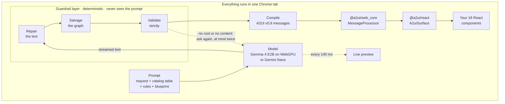
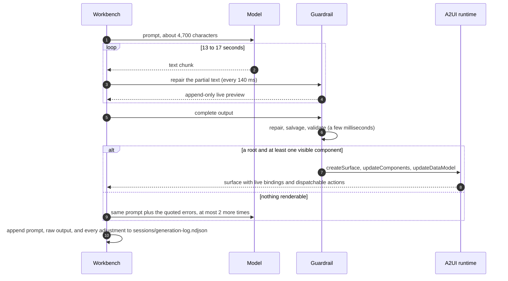
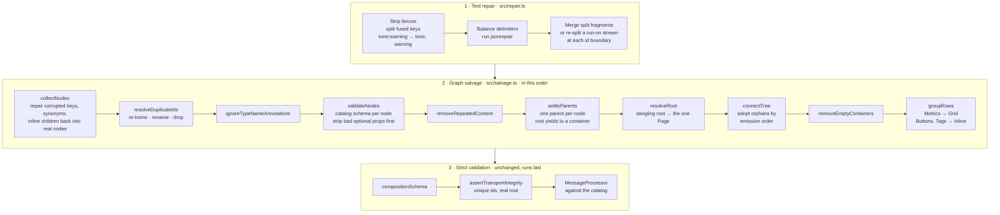
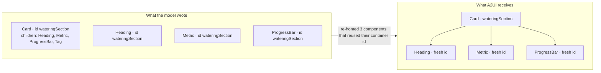

# Local UI Composer

Describe an interface in plain language. A two-billion-parameter model running inside your Chrome tab composes it from an 18-component design system, speaking [A2UI v0.9](https://a2ui.org), and Google's official A2UI packages render it. Nothing leaves the browser after the first download.

The model is not the interesting part. On its own, its output fails `JSON.parse` 53 times out of 65. The interesting part is the guardrail layer between the model and A2UI: it reads what the model meant, validates it strictly, hands A2UI a graph it can render, and logs every adjustment so you can see who authored what.

## What happens when you press Compose



The model writes every word, picks and orders the components, and chooses tones, icons, and action names. The design system owns all visual decisions. The guardrail owns the gap between the two.



## Try it

**Live demo:** [southleft.github.io/local-generative-ui-demo](https://southleft.github.io/local-generative-ui-demo/). You need Chrome with WebGPU, and the first Gemma load downloads 2.0 GB once into your browser's cache. On the public site the Chrome built-in model shows as unavailable unless your Chrome has the Prompt API flag enabled; it works locally on an eligible profile.

### A fourth model, when you have the file

The LiteRT dropdown also lists **Gemma 4 E2B · catalog-tuned**: the same model with a LoRA fine-tune on this catalog and the A2UI format, vocabulary pruned to 32k tokens and exported at int8 (2.14 GB). It runs through the runtime's non-streaming path with the file placed inside the WASM heap (`src/litert-heap-loader.ts`). The artifact is not published yet, so the option is disabled on the hosted site; locally, put the file where `vite.config.ts` expects it (or point `TUNED_MODEL_PATH` at it) and it appears, and a deployed build takes a hosted URL via `VITE_TUNED_MODEL_URL`. How it was trained and what it scores is in [`docs/fine-tuning-feasibility.md`](docs/fine-tuning-feasibility.md) and [`docs/decision-log.md`](docs/decision-log.md).

## Run it

Requirements: Node `^20.19 || >=22.12` and Chrome with WebGPU. Chrome's built-in model also needs an eligible desktop profile that exposes `LanguageModel`.

```sh
npm install
npm run dev
```

Open the Vite URL in Chrome, load Gemma 4 E2B (a one-time 2.0 GB download from Hugging Face, cached so later loads take about two seconds), type a request, and press Compose. The **Deterministic fixture** button renders a fixed A2UI message stream through the same processor and renderer with no model at all, which is the fastest way to confirm the rendering path works on your machine.

Two things arrive over the network, once: the model weights, and the 19.8 MB WebGPU runtime that `@litert-lm/core` fetches from jsDelivr. Prompts and generations never leave the tab.

## The guardrail, stage by stage

Why it exists, in numbers from the 65 generations in the session log. The model's vocabulary held: one component name outside the catalog and five unknown property keys, total. Its serialization did not: 53 first attempts were not valid JSON, 21 reused an id, and many inlined whole components into a `children` list or invented a parent-pointer syntax. The design was in there. It just wasn't written down in a form any parser accepts.



Every pass emits a named adjustment when it changes something: *re-split*, *reconstructed*, *re-homed*, *renamed*, *ignored annotation*, *recovered*, *adopted*, *wrapped*, *grouped*, *pruned*, *removed*, *dropped*. The count shows on the run as "guardrail adjustments", in the debug trace, and in the session log. Zero means the model nailed it. Fourteen means it looped or truncated, and the trace says which.

The layer runs on three rules, and every borderline case resolves against them:

1. **It may only reattach what the model emitted.** Every recovery traces back to bytes in the raw output.
2. **It never sees the prompt.** It cannot steer a surface toward what was asked for, or notice a missing field and add one.
3. **It never invents content.** A label-less button takes its label from the action name the model wrote. If there is nothing to derive from, the button goes.

### One real recovery

For the houseplant tracker, Gemma listed a Card's children as component type names and then emitted each leaf using the Card's own id, a syntax it invented on the spot:

```json
{"id":"wateringSection","component":"Card","children":["Heading","Metric","ProgressBar","Tag"]},
{"id":"wateringSection","component":"Heading","text":"💧 Watering Schedule","level":"h2"},
{"id":"wateringSection","component":"Metric","label":"Last Watered","value":"3 days ago"}
```

Plain duplicate-id handling keeps the Card, prunes the type names as missing references, and deletes the now-empty Card: 3 components render out of 21. Reading a leaf that reuses an earlier container's id as "this belongs to that container" recovers all 21 from the same bytes.



## How the guardrail helps A2UI render

A2UI's runtime is strict by design and does no repair. The guardrail's job is to hand it something it will accept, and to keep out the one thing it accepts silently.

| The official `@a2ui/web_core` processor | The guardrail, before hand-off |
| --- | --- |
| Refuses a surface whose catalog id it does not know | Compiles every surface against the one real catalog id |
| Owns surface state, the data model, binding resolution, and action dispatch | Seeds the data model for every `value: { path }` the model wrote, so inputs are live on first paint |
| Stores component names as given and fails at **render** time if one is not in the catalog | Rejects non-catalog components and invalid props upstream, so a render never fails half-drawn |
| Expects a well-formed message stream | Guarantees unique ids, an existing root, single parenthood, no cycles, and a visible component |
| Cannot parse broken JSON | Repairs the text and reconstructs the graph first |

Everything the model says stays in A2UI's own component syntax: props sit alongside `id` and `component`, bindings are `value: { path }`, actions are `action: { event: { name } }`. The harness adds only the three message envelopes, which is what a transport does. The catalog is a real A2UI `Catalog` whose prop schemas are built from the library's own `DynamicStringSchema`, `ActionSchema`, and `ChildListSchema`, so the official binder resolves bindings and actions exactly as it does for the built-in catalog. Only the React implementations are ours.

### Recover or Strict

The **Guardrails** toggle switches the whole layer off. In *Strict*, raw output must survive plain `JSON.parse` and the strict schemas with no repair, coercion, or restructuring, and the live preview is disabled because it is itself a salvage product. The model still gets its two repair prompts. Because LiteRT-LM decodes greedily, the same prompt produces the same bytes, so the two modes are a controlled experiment.

| Rocket-launch prompt, 24 August 2026, byte-identical first attempt | Result |
| --- | --- |
| Recover | 18 components in 13 s, seven adjustments |
| Strict | Failed `JSON.parse` on all three attempts, 38 s |

Replaying every logged first attempt through both paths: 12 of 65 parse as JSON, 5 pass the strict schema untouched, 65 render through the guardrail. The layer was built from these logs, so treat 65 as an upper bound. The live tally while it was being built is 56 of 64 first-attempt renders and 63 of 64 overall.

## What it cannot do

- **Recover content the model never wrote.** A request naming six things produced four; name and phone were never emitted, and rewording the prompt changed nothing byte for byte.
- **Protect you from a bad rule.** Reserving `value` on every component instead of only on inputs silently dropped every Metric on every dashboard, and the surfaces still looked plausible. The log caught it, eighteen "Dropped Metric" lines across six runs. Keep the raw output.
- **Round-trip actions.** Button presses reach the host and stop; A2UI's `deleteSurface`, data-driven child templates, and `functionCall` values are never requested from the model, although the catalog renders a template list the way the library's own does.
- **Run on any model.** LiteRT-LM.js 0.14 loads only Google's Gemma 4 E2B and E4B web artifacts; a Qwen 3 file was rejected. See [`docs/fine-tuning-feasibility.md`](docs/fine-tuning-feasibility.md).

## Where to look

| | |
| --- | --- |
| `src/catalog.tsx` | The 18 components, each declared once: A2UI schema, prompt line, coercion rules, render function. Every other layer derives from this table. Adding a component means adding one entry; one test round-trips every entry through salvage into a valid A2UI message stream. |
| `src/prompt.ts` | Catalog table, rules, transport schema, keyword-matched blueprints. |
| `src/repair.ts`, `src/salvage.ts` | The guardrail: text repair, then the salvage passes in the order drawn above. |
| `src/a2ui-protocol.ts` | Message envelopes, integrity checks, and the hand-off to the official processor. |
| `src/streaming.ts`, `src/streaming-preview.tsx` | The append-only live preview. |
| `src/model-provider.ts` | One interface over LiteRT-LM.js (`local-model.ts`) and Chrome's Prompt API (`chrome-language-model.ts`). |
| `src/use-composer-workbench.ts` | The generation loop and workbench state. `App.tsx` only lays out the shell. |
| `src/history.ts`, `src/session-log.ts`, `vite.config.ts` | Zod-validated localStorage history of rendered runs, and the dev-only middleware that appends every run to `sessions/generation-log.ndjson` (gitignored). |

In the app, the **Prompt & guardrails** tab shows the exact prompt, the editable blueprints and their trigger keywords, the synonym vocabulary, and the salvage playbook. **Flag for review** logs the active run with a note.

## Verify

```sh
npm test            # 120 tests: salvage, repair, prompts, streaming, providers, A2UI provenance, workbench, captured-run replays
npm run typecheck
npm run build       # one 471 kB chunk (142 kB gzip) plus the lazily loaded LiteRT runtime; a single zod@3
```

`src/captured-runs.test.ts` replays byte-exact model outputs from the session log and asserts each recovery, so a logged failure becomes a regression test. Every push to `main` runs the same checks and publishes the build to GitHub Pages through `.github/workflows/pages.yml`. Browser QA against real Gemma 4 E2B on Chrome 151 covered the fixture, cold and cached loads, streamed generations, history restore, action round-trips, and the Chrome-unavailable path.

## Further reading

- [`docs/generation-pipeline.md`](docs/generation-pipeline.md): every stage with real examples and the honest attribution of model versus harness.
- [`docs/field-notes.md`](docs/field-notes.md): what Gemma 4 E2B actually does, and the measured effect of each guardrail.
- [`docs/fine-tuning-feasibility.md`](docs/fine-tuning-feasibility.md): whether a fine-tuned model could speak this catalog better, and why it cannot run here yet.
