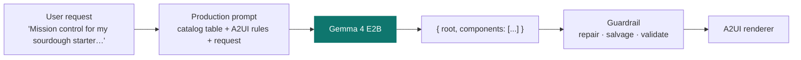
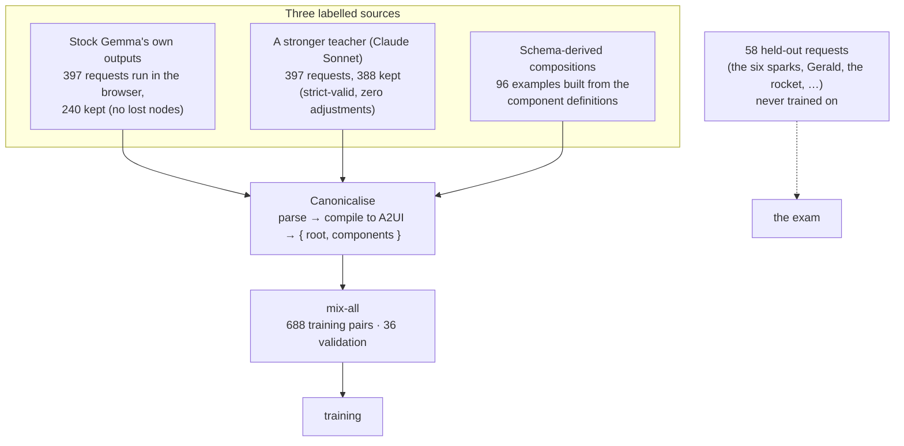
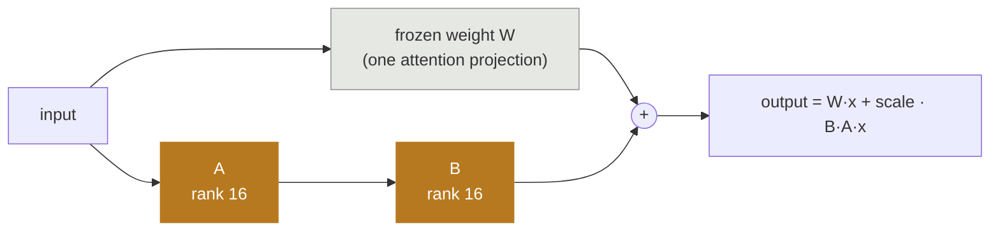
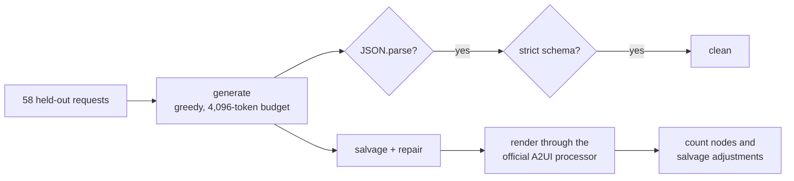
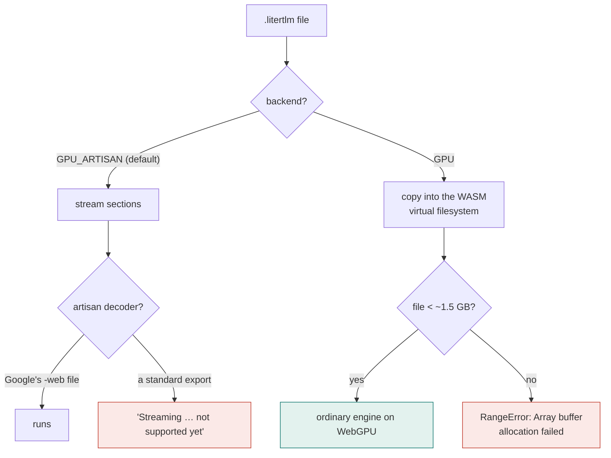
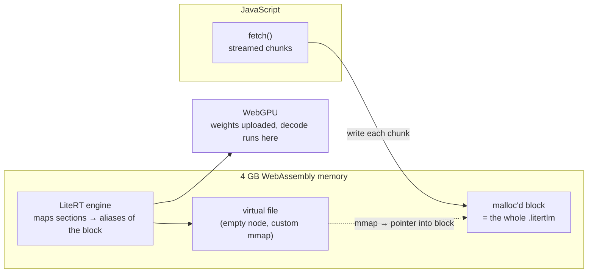
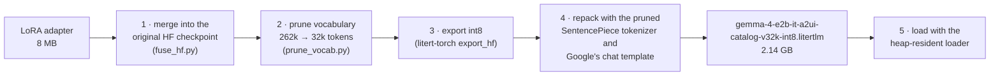
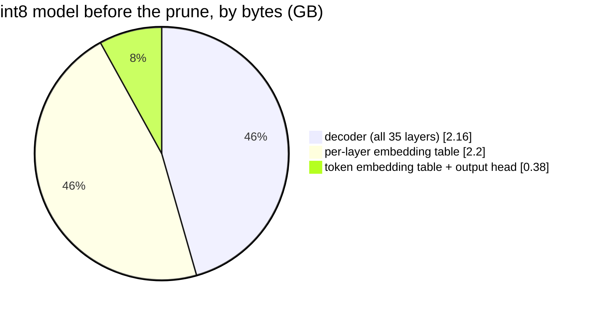
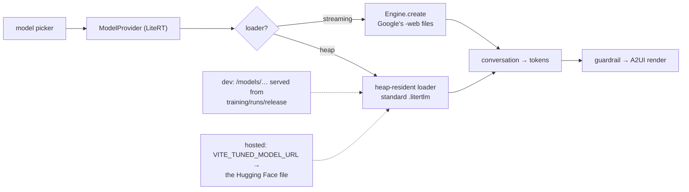

# From fine-tune to browser: how the catalog-tuned Gemma was made, and how it runs in LiteRT-LM.js

This is the plain-language account of two pieces of work done on 10–12 September 2026: teaching Gemma 4 E2B to write [A2UI](https://a2ui.org) compositions for this prototype's 18-component catalog, and getting that custom model to run in the browser through the same LiteRT-LM.js runtime the prototype already uses. Every number comes from a captured run in this repo; the dated reasoning behind each choice is in [`decision-log.md`](decision-log.md).

**The result in one table.** All 58 held-out requests, generated in the browser on WebGPU, scored by the prototype's own guardrail (`training/runs/stamp3/`):

| model, in the browser | valid JSON on the first try | passes strict validation | rendered | median salvage adjustments | median seconds |
| --- | --- | --- | --- | --- | --- |
| stock Gemma 4 E2B (Google's file) | 4 of 58 | 1 | 57 | 6 | 12.4 |
| catalog-tuned Gemma 4 E2B (this work) | **50 of 58** | **50** | **58** | **2** | 20.6 |

The tuned model is a 2.14 GB file, loads in about 5 seconds once cached, and is the third choice in the prototype's model picker next to stock Gemma and Chrome's Gemini Nano. It is published at [huggingface.co/bvoran/gemma-4-e2b-it-a2ui-catalog-litertlm](https://huggingface.co/bvoran/gemma-4-e2b-it-a2ui-catalog-litertlm).

---

## Part 1: the fine-tune

### 1.1 What the model has to learn

The prototype sends a small model one prompt: the catalog of 18 components as a table, the rules of the A2UI transport format, and the user's request. It expects back one JSON object: a `root` id and a flat list of components that reference each other by id. Stock Gemma understands the request and picks sensible components, but it writes the JSON badly: fused keys, children inlined instead of referenced, unclosed objects. The guardrail repairs most of that, which is why the prototype works at all, but only 4 of 58 raw outputs are valid JSON.

The fine-tune does not teach Gemma new ideas about interfaces. It teaches it to write the answer in the format the app wants, first time.



### 1.2 Where the examples came from

A fine-tune needs pairs of prompt and ideal answer. Nobody had written A2UI compositions for this catalog, so three sources were made, and every one of them was passed through the guardrail: the target stored for training is exactly the composition the app would have rendered, serialised correctly. The guardrail is the labeller.



The requests themselves were generated from templates across seven families (forms, chat, dashboards, settings, checkout, comparisons, free-form), 455 in total; 397 for training data, 58 held out for scoring. The prompts in the training pairs are byte-for-byte the prototype's production prompt, so the model trains on what it will see.

### 1.3 What LoRA changes

Gemma 4 E2B has about 4.6 billion parameters. Training all of them is out of reach on a laptop and unnecessary for a formatting habit. LoRA (low-rank adaptation) freezes the model and adds two small matrices beside a chosen weight: the original weight still does its job, and the adapter adds a correction learned from the examples. Only the adapters are trained.



Here the adapters sit on the attention projections (query, key, value, output) of the last 16 of 35 layers, with rank 16 and scale 20. That is 2.1 million trainable parameters, 0.045% of the model, and the adapter file is 8 MB. Two of Gemma 4's engineering details mattered: the top 20 layers share their key and value projections with lower layers, so those layers have no k or v weights to adapt (32 adapter tensors in total), and the model has a per-layer embedding table that is untouched by the adapter.

### 1.4 The training run

Training ran on an M1 Max with mlx-lm, one example at a time, 4,096-token sequences. The prompt part of each example is masked out of the loss, so the model is only graded on the answer. Two settings were needed to make training match inference: Gemma 4's chat template injects a "thinking" channel by default, which the app never uses, so it was disabled; and mlx-lm's loader rejects the checkpoint's 60 unused key/value tensors and the vision and audio towers, so a text-only copy was made first.

```mermaid
sequenceDiagram
  participant D as Data (688 pairs)
  participant M as Gemma + adapters
  participant C as Checkpoints
  loop every step
    D->>M: prompt + target (prompt masked)
    M->>M: predict the target, one token at a time
    M->>M: update the adapters only
  end
  M->>C: save every 100 steps
  Note over M,C: macOS reset the GPU twice during the first run;<br/>the trainer resumed from the last checkpoint each time
  M->>C: final adapters (8 MB)
```

Two runs were kept:

| run | epochs | iterations | wall time | validation loss | what it showed |
| --- | --- | --- | --- | --- | --- |
| `mix-all` | 3 | 2,064 | ~2.5 h (two GPU resets) | 1.31 → 0.46 | learned the format, but loops on long pages |
| `mix-all-2ep` | 2 | 1,376 | 72 min | 1.31 → 0.50 | the one that ships: fewer loops, more valid pages |

Validation loss says how well the model predicts the held-back answers; it went down in both runs and told us almost nothing about which run was better. The exam did.

### 1.5 The exam

The score that matters is the prototype's own pipeline: generate for the 58 held-out requests with greedy decoding, then run each output through the same parse, repair and validation the app uses. Four numbers: valid JSON on the first try, strict validation pass (no repair at all), rendered (something usable came out), and rendered without losing a node (nothing dropped or de-duplicated by the guardrail).



On MLX in bf16 (the model as trained, before any export), the three-epoch run went from 11 to 48 valid of 58; the same pipeline later scored every browser export. The lesson from three versus two epochs: the third epoch is where the model learned to repeat cards on long pages (15 of 58 pages needed a repetition cut against 5 for two epochs), so two epochs ship.

### 1.6 What did not work, and why it is still in the log

The remaining weakness is repeated ids on long pages (`heading2` used for two different headings). A data fix was tried: rewriting every training target with content-derived ids (`headingPrivacyControls`). It halved the reused-id cases and made everything else worse (36 valid of 58, five empty pages), because an A2UI parent names its children before they are written: the model had to invent a slug in the `children` list and reproduce it exactly later, and could not. The counter-style ids stayed. The full reasoning, with numbers, is in the decision log.

---

## Part 2: into the browser

### 2.1 Why the obvious path failed

LiteRT-LM.js loads Gemma by streaming a file into a WebGPU runtime. The prototype's stock model is Google's `gemma-4-E2B-it-web.litertlm`, a specially compiled "artisan" file. Google's exporter (`litert-torch`) turns a fine-tuned checkpoint into a standard `.litertlm`, and the runtime's default path refuses that file with two precise errors: it cannot stream the tokenizer section, and it cannot stream an ordinary prefill/decode model. No public tool makes the artisan form, so at first the browser looked closed.

Reading the runtime's JavaScript showed a second door. The streaming path is used only for the default `GPU_ARTISAN` backend. Ask for `backend: GPU` instead and the package copies the whole file into its virtual filesystem and starts the ordinary engine, which the same WebAssembly binary already contains, together with the WebGPU accelerator. That path takes standard files. It just cannot get a large file in: it wants the whole thing as one JavaScript buffer, and Chrome refuses any single buffer of 2 GB.



### 2.2 The heap-resident loader

The runtime lives in a 4 GB WebAssembly memory. The fix is to never hold the file in JavaScript at all: reserve a block inside that memory, stream the download straight into it, then create an empty file in the runtime's virtual filesystem and give it custom file operations whose memory-map call answers with a pointer into the block. When the runtime maps a model section, it gets an alias of bytes it already owns instead of a copy. The file costs its own size in memory plus the runtime's working set, about 0.7 GB for Gemma 4 E2B.



This is `src/litert-heap-loader.ts`, about 150 lines, unit-tested against a fake runtime. Proven first with Google's own standard (non-web) Gemma file, which loaded in 6 seconds and answered correctly, before any custom model was tried. It works with the unmodified npm package; nothing was rebuilt.

### 2.3 The export pipeline

Getting from the trained adapter to a file the browser will take is five steps. Two of them hide traps that cost an afternoon.



**Merge.** mlx-lm's own merge writes tensors under its internal names and only the text-only tensors; the exporter silently listed every weight as missing and exported random numbers, so the first exports produced garbage while loading fine. `fuse_hf.py` applies the adapter's correction (`W + scale · B·A`) to the untouched Hugging Face checkpoint instead, and the exporter reports zero missing weights.

**Prune the vocabulary.** Gemma's 262,144-token vocabulary is most of this model at int8: the two embedding tables and the tied output head are about 60% of the file. The prototype's prompts and the whole training set use 11,323 tokens. Keeping every special and byte-fallback piece, every id below 1024 (so the start, stop and turn tokens keep their ids), every token the corpus uses, and the most frequent remaining pieces up to 32,768 shrinks the tables 8× while the model, tested on MLX, scores exactly as before. The matching tokenizer is written at the same time.



**Export at int8, and only int8.** The heap arithmetic is simple: 4.0 GB minus about 0.7 GB working memory leaves roughly 3.3 GB for the file. Full-vocabulary int8 is 4.72 GB, so at first int4 looked forced. Every post-training int4 form was tried and every one destroyed the fine-tune: per-channel int4 reverts to stock-like garbage, weight-only int4 overruns the heap during setup, blockwise int4 keeps the format and then loops. A small harness reproduces the exporter's quantisation arithmetic on MLX in two minutes per configuration, which is how nine variants were checked without nine seven-minute exports. Int8 keeps the fine-tune byte for byte on the dashboard prompt; with the vocabulary pruned it is 2.14 GB, and the heap settles at 3.06 GB.

**Repack.** Two details of the exported file are wrong for the browser: it embeds the 32 MB Hugging Face tokenizer (which alone costs half a gigabyte of heap and does not know the pruned ids), and it carries a chat template the runtime's template engine cannot run. The file is unpacked, the tokenizer section swapped for the pruned SentencePiece model, and Google's own Gemma 4 template used, then packed again.

### 2.4 Where it plugs into the prototype

Nothing about the app's prompt, guardrail or renderer changed. The model definition list gained a fourth entry with a `loader: 'heap'` flag; the loader branches on that flag; the dev server serves the file from the training folder; a deployed build reads the hosted URL from an environment variable at build time.



### 2.5 Checked where the reader will run it

The final numbers were taken with a standalone script that starts a fresh, extension-free Chrome, loads each model through the app's own loader and runs all 58 held-out requests through the app's real prompt and guardrail. Then the hosted site was driven through its actual UI: pick LiteRT, pick the tuned model, load (177 seconds for the 2.14 GB download from the Hub plus compile), generate a spark, and the page rendered on the first attempt.

One caveat learned the hard way: a long-running Chrome that had survived several out-of-memory aborts made every load take ten times longer and time out on GPU readback, and for an hour that looked like a property of the files. A fresh Chrome loads the same files in 5 to 8 seconds. Measure in a clean browser.

---

## Reproduce it

Everything runs from the repo root; [`training/README.md`](../training/README.md) lists every script and what it needs (Apple Silicon, mlx-lm, litert-torch, a local Gemma 4 E2B download, an `.env` with `HF_TOKEN`). One heavy job at a time on a laptop. The exam outputs behind every number in this document are committed under `training/runs/`, so the scoring step runs anywhere:

```
# re-score the shipped model's browser exam (or any outputs file) the way the app renders it
EVAL_FILES=training/runs/stamp3/exam-tuned-2ep.jsonl npx vitest run -c training/vitest.config.ts eval-replay

# data: prompts, labelled sources, canonical mix (the Gemma source needs a sessions/generation-log.ndjson)
npx vitest run -c training/vitest.config.ts assemble

# train two epochs (resumes across GPU resets), then merge → prune → export → repack → browser exam
bash training/scripts/train-and-exam.sh mix-all-2ep 1376

# publish a run to the Hub
bash training/scripts/publish-hf.sh training/runs/mix-all-2ep <user>/<repo> training/runs/mix-all-2ep/MODEL_CARD.md
```

## Glossary

- **A2UI**: an open format in which a model describes an interface as a flat list of components with ids, rendered by a client that owns the visual design.
- **LoRA**: training small add-on matrices beside frozen weights; cheap, and the adapter is a few megabytes.
- **Epoch**: one pass over the training set. Two were right here; three taught looping.
- **Greedy decoding**: always take the most likely next token; the same prompt gives the same output.
- **Quantisation**: storing weights in fewer bits. Int8 halves the size and kept this fine-tune intact; every int4 variant broke it.
- **Vocabulary prune**: dropping tokens the model will never see, which shrinks its embedding tables; new ids are the positions in the kept list.
- **WASM heap**: the fixed 4 GB memory a WebAssembly program can address in the browser; the model file has to fit inside it with room to work.
- **MEMFS / mmap**: the runtime's in-memory virtual filesystem and the call it uses to map a file section into memory; the loader answers that call with a pointer to bytes it already placed.
- **Artisan artifact**: Google's WebGPU-compiled form of a model that the runtime's streaming path expects; not producible with public tools.
