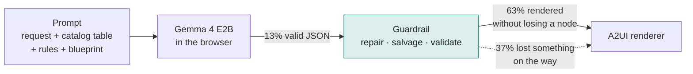
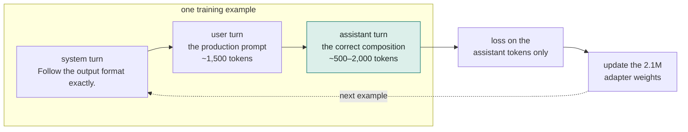
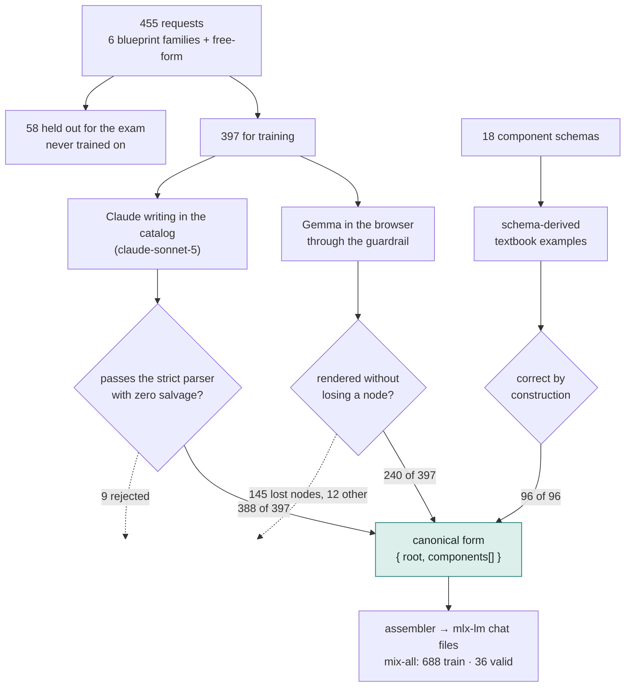
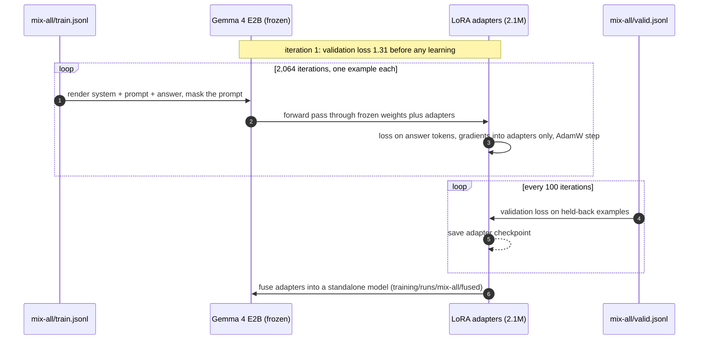
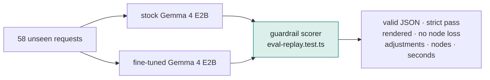

# How the fine-tune works, and why

A plain account of teaching Gemma 4 E2B to write this prototype's 18-component catalog in A2UI, so the model gets it right more often and the guardrail has less to fix. Every number here comes from files in `training/` and `sessions/`; the commands to reproduce each step are at the end.

## 1. The problem we are trying to move

Today the browser model writes the right *design* and the wrong *JSON*. On 397 fresh requests, only 53 of its answers parsed without repair. The guardrail reads what it meant and rebuilds it, but on 145 of those answers it had to throw a component away to render anything.



The fine-tune's whole purpose is to move correctness upstream: the same prompt, the same guardrail, but a model that hands the guardrail less to do. Success is measured as fewer adjustments on requests the model has never seen, with nothing lost.

## 2. What "training" means here

We do not retrain Gemma. The 4.6 billion base weights stay frozen. A small set of extra weights, 2.1 million of them (0.045 percent), is attached to the attention layers and *those* learn from examples. This is LoRA, and it is why the job fits on a laptop. The result is an adapter you can fuse into the base model or carry separately.

An example is a pair: the exact prompt the app sends, and a correct answer in A2UI component syntax. The model reads the prompt, predicts the answer one token at a time, and is corrected wherever its prediction differs from the correct answer. Only the answer is scored; the prompt is masked out, so the model learns to *write* compositions rather than to recite the catalog table back.



The prompt is byte-for-byte the one the app builds (`buildCompositionPrompt` plus the transport schema as text), so the trained model drops into the app with no prompt change, and it learns the convention rather than memorising wording.

## 3. Where the examples come from

Three sources, each with its own check, each labelled so the evaluation can say which one moved the numbers.



Why three:

- **Gemma through the guardrail** is the honest one. The guardrail is the labeler: it keeps the model's own content and serialises it correctly, and it rejects the runs where it had to invent structure or drop content. Training on this teaches the model to write *its own designs* properly.
- **Claude, strictly checked** supplies volume and layout quality. Nothing needing salvage is kept, so every example is a clean A2UI composition; it is distillation from a bigger model, and the label says so.
- **Textbook examples** come straight from the zod schemas: one for every tone, level, input type, accent and column count, plus the conventions the models get wrong (bindings only on inputs, actions only on buttons, children by id, a root that names a real Page). They are small and exact.

All three are normalised the same way (parse → compile to A2UI → `{ "root": "root", "components": [...] }`) so the sources differ only in provenance, never in form.

## 4. The training run

| Setting | Value | Why |
| --- | --- | --- |
| Base model | Gemma 4 E2B instruction-tuned, bf16 | The model the app runs |
| Method | LoRA, rank 16, attention projections, last 16 of 35 layers | Enough for format adherence; keeps the adapter tiny |
| Data | `mix-all`: 688 train, 36 validation | All three sources |
| Epochs | 3 (2,064 iterations, batch 1) | Small data, long sequences |
| Sequence length | 4,096 tokens | Prompt plus the longest kept answer |
| Learning rate | 1e-5, AdamW | mlx-lm default for LoRA |
| Prompt masking | on | Loss on the answer only |
| Hardware | Apple M1 Max, 64 GB, MLX | No cloud, no Colab |



Two things had to be fixed before this could run, both worth knowing:

- **Google's checkpoint carries 60 unused tensors.** Gemma 4 E2B shares key/value projections across its top 20 layers, but the download still ships those layers' k/v weights, and mlx-lm's strict loader refuses unknown tensors. `prune_checkpoint.py` writes a local text-only copy without them (and without the vision and audio towers). Weights are otherwise byte-identical.
- **mlx-lm turns on Gemma's hidden thinking channel by default.** That inserts a `<|think|>` marker and makes the model write a private reasoning preamble before answering. The app never asks for that, so training and evaluation both render with thinking off (`lora_nothink.py`, `eval_generate.py`), and the training turn matches inference byte for byte.

## 5. The exam

The 58 held-out requests include the six workbench sparks, Gerald, and the rocket, so the blog's before-and-after uses prompts readers already know. Both models generate greedily on the same MLX runtime, and the real guardrail scores every output.



The metric that matters is **adjustments per page with no node loss**. Valid JSON alone can hide an empty interface; the Nano experiment proved that.

### Baseline, measured before training

| model | n | valid JSON | strict pass | rendered | first try, no node loss | median adjustments | median nodes | median s |
| --- | --- | --- | --- | --- | --- | --- | --- | --- |
| stock Gemma 4 E2B | 58 | 11 | 10 | 58 | 54 | 2 | 15 | 8.1 |

### Result (mix-all, 3 epochs, 2,064 iterations; validation loss 1.31 → 0.46)

| model | n | valid JSON | strict pass | rendered | first try, no node loss | median adjustments | median nodes | median s |
| --- | --- | --- | --- | --- | --- | --- | --- | --- |
| stock Gemma 4 E2B | 58 | 11 | 10 | 58 | 54 | 2 | 15 | 8.1 |
| fine-tuned (mix-all) | 58 | **48** | **48** | 58 | **41** | 2 | 17 | 13.3 |

Valid JSON by family for the fine-tune: form 7/7, chat 4/7, dashboard 6/7, settings 5/7, compare 5/6, checkout 7/7, free-form 14/17.

Showcase prompts, stock → fine-tuned (nodes rendered, guardrail adjustments):

| prompt | stock | fine-tuned |
| --- | --- | --- |
| Gerald the houseplant | 17 nodes, 3 adj | 26 nodes, 0 adj |
| status dashboard | 14, 2 | 14, 0 |
| sourdough mission control | 19, 0 | 18, 1 |
| model rocket | 12, 3 | 11, 4, lost a node |
| patient intake | 12, 1 | 33, 3, lost a node |
| support chat | 11, 1 | 21, 6, lost nodes |
| account settings | 17, 4 | 16, 4, lost nodes |
| checkout | 12, 2 | 24, 2, lost a node |

**What the model learned.** The syntax, almost completely: strictly valid output went from 10 of 58 to 48 of 58, and every output uses the canonical shape (root named `root`, flat components, ids referenced by name). The serialization failures that motivated the guardrail, fused keys, inlined children, unclosed objects, are gone.

**What it also learned.** To write bigger pages. Median output length rose about 40 percent and generation time from 8 to 13 seconds, because the teacher's compositions are richer than Gemma's own. With greedy decoding, bigger pages loop: the 17 runs that lost a component are dominated by repeated cards, buttons and headings with duplicate ids, concentrated in the settings family (five of seven settings pages, one of them 76 components against a 60-component cap), plus a handful of prop-type mistakes the stock model never made (a Select with no options, a StatusBadge with a numeric label, an Alert with the title and message in the wrong shape).

**Net.** Strictly valid output went up five times; output that renders without losing a component went down, 54 to 41. The guardrail's median stayed at 2 because its work moved from repairing JSON to pruning repeats and dropping components missing a required prop. Fixing the JSON is not the same as fixing the UI, which is the second-model lesson again from the other direction. One caveat in the fine-tune's favour: the app cuts a verbatim loop as it streams and renders what arrived, and this exam had no such guard, so in the app the looping pages would lose less.

**Obvious next runs, not yet done:** two epochs instead of three (validation loss stopped improving around iteration 1,300), the Gemma-only mix so the model learns its own shorter voice, or capping teacher examples at 20 components. Each is a few hours on the same pipeline.

## 6. What this does and does not prove

- The stock baseline on MLX matches the browser closely (valid JSON about one time in five, the guardrail carrying the rest), so the comparison is credible. It is still a different runtime: LiteRT's web artifact is quantised, MLX runs bf16, and the context-window experiment showed runtimes change outputs.
- A model trained on this catalog is welded to this catalog. The prompt still carries the table, so small edits should follow; new components or a different design system mean retraining. Training across several synthetic catalogs so the model learns the convention instead of the vocabulary is the natural version two, and the textbook generator is the first step.
- The browser cannot load the result today. LiteRT-LM.js loads only Google-produced `-web` artifacts and exposes no adapter loading. The fused model runs on the LiteRT-LM CLI natively, or in a browser through a different runtime such as WebLLM. The A2UI catalog, guardrail and renderer are untouched either way.

## 7. Reproduce it

```sh
node training/scripts/make-prompts.mjs                                  # 455 requests, split train/eval
npx vitest run training/scripts/build-prompts.test.ts                   # exact production prompts
# Gemma source: run the training prompts through the workbench (sessions/generation-log.ndjson)
ANTHROPIC_API_KEY=... node training/scripts/teacher.mjs --max-tokens 4000   # teacher source
npx vitest run training/scripts/catalog-set.test.ts training/scripts/build-catalog-prompts.test.ts
npx vitest run training/scripts/assemble.test.ts                        # mixes + stats
training/.venv/bin/python training/scripts/prune_checkpoint.py          # loadable local checkpoint
training/scripts/train.sh mix-all 3                                     # LoRA, then fuse
training/.venv/bin/python training/scripts/eval_generate.py --out training/runs/eval-base.jsonl
training/.venv/bin/python training/scripts/eval_generate.py --adapter-path training/runs/mix-all/adapters --out training/runs/eval-mix-all.jsonl
EVAL_FILES=training/runs/eval-base.jsonl,training/runs/eval-mix-all.jsonl npx vitest run training/scripts/eval-replay.test.ts --reporter=verbose
```
