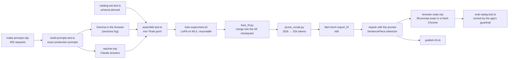

# training/

Everything used to fine-tune Gemma 4 E2B on this catalog and get the result into the browser. The plain-language walkthrough is [`../docs/fine-tune-to-browser.md`](../docs/fine-tune-to-browser.md); the dated decisions are in [`../docs/decision-log.md`](../docs/decision-log.md); the trained model is on the Hub at [bvoran/gemma-4-e2b-it-a2ui-catalog-litertlm](https://huggingface.co/bvoran/gemma-4-e2b-it-a2ui-catalog-litertlm).

What is here and what is not:

| folder | contents |
| --- | --- |
| `data/` | The 455 requests (`prompts.jsonl`), the exact production prompts (`prompts-built.jsonl`), the teacher outputs, the schema-derived set, and the assembled mixes (`mix-all` is the one that trained the shipped model; `mix-all-2ep` is the same data; `mix-all-ids` is the failed content-id variant). |
| `configs/` | The mlx-lm LoRA config (rank 16, scale 20, attention projections of the last 16 layers) and the blockwise-int4 quantiser recipe that did not work. |
| `scripts/` | The pipeline, listed below. |
| `runs/` | Only the exam outputs and reports (raw model outputs for all 58 held-out prompts, per model) so the numbers in the docs can be re-scored. Adapters, merged checkpoints and exports are multi-gigabyte and live on the Hub or on the training machine. |
| `HOW-THE-FINE-TUNE-WORKS.md`, `STAMP2.md`, `STAMP3.md` | The explainer written during the work and the two decision points as they were put to the author. |

## Pipeline

`train-and-exam.sh <mix> <iterations>` runs everything from training to the exam, one heavy job at a time. Requirements, all local: Apple Silicon with 32 GB or more, a Python venv with `mlx-lm` (`.venv/`), `litert-torch-nightly` installed with `uv tool install`, a second venv with `litert-lm` for the repack step (`.venv-litertlm/`, or set `LITERT_SDK_PYTHON`), `GEMMA_HF_SNAPSHOT` pointing at a local `google/gemma-4-E2B-it` download, and `playwright-core` for the browser exam. Secrets come from a `.env` in the repo root (`HF_TOKEN`, and `ANTHROPIC_API_KEY` only for `teacher.mjs`); the file is gitignored.

| script | what it does |
| --- | --- |
| `make-prompts.mjs` | Seeded generator for the 455 requests across seven families, split 397 train / 58 held out. |
| `build-prompts.test.ts`, `build-catalog-prompts.test.ts` | Materialise the byte-exact prompt the app sends, per request. |
| `teacher.mjs` | Ask a stronger model for a composition per request (resumable). |
| `catalog-set.test.ts` | Micro-examples generated from the component schemas. |
| `assemble.test.ts` | Validate every candidate through the real guardrail and write the mixes. |
| `reid-targets.test.ts` | The content-derived-id rewrite (kept as the record of a negative result). |
| `prune_checkpoint.py` | Text-only copy of the checkpoint that mlx-lm's strict loader accepts. |
| `lora_nothink.py` | mlx-lm's trainer with Gemma 4's thinking channel disabled. |
| `train.sh`, `train-supervised.sh` | One run; the resumable version that survives macOS GPU resets. |
| `eval_generate.py`, `eval_pruned.py`, `eval_fakequant.py` | Generate the held-out prompts on MLX: as trained, after the vocabulary prune, or with the exporter's quantisation simulated. |
| `fuse_hf.py` | Merge the adapter into the original Hugging Face checkpoint (the mlx-lm merge cannot be exported). |
| `prune_vocab.py`, `quantize_table.py` | Vocabulary prune with a matching SentencePiece model; per-table quantisation. |
| `native_suite.py` | Run a `.litertlm` through Google's Python SDK as a control. |
| `browser-suite.mjs`, `e2e-hosted.mjs` | The 58-prompt exam in a fresh Chrome through the app's loader; the hosted-site check through the real UI. |
| `eval-replay.test.ts` | Score any outputs file the way the app renders it. |
| `train-and-exam.sh`, `stamp3-pipeline.sh` | The chained pipelines that produced the shipped model. |
| `publish-hf.sh` | Upload a run (artifact, tokenizer, adapter, model card) to the Hub. |
